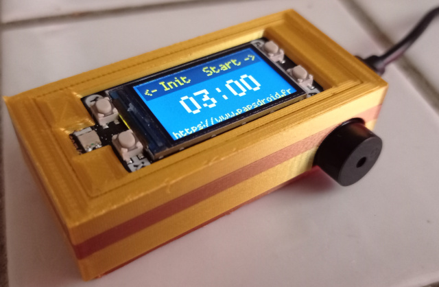

# PicoTimer

Compte à rebours contrôlé par un Raspberry PICO. Il est doté d'un écran LCD, d'un buzzer , de 4 boutons poussoirs et d'une led RGB.
* En haut à gauche: bouton Init, sert à initiliaser le timer à zéro lors d'un appui long
* En haut à droite: bouton Start pour démarrer le timer
* En bas à gauche: réglage des minutes (appuis court et long possibles)
* En bas à droite: réglage des secondes (appuis court et long possibles)

Le timer se règle de 1s à 90mn

Lorsqu'il démarre, la led clignote en vert, puis clignote en rouge s'il reste moins de 30' avec le buzzer qui bippe. Enfin s'il reste moins de 10 secondes le clignotement rouge s'accélère. Lorsque le timer est terminé, le buzzer sonne plus aigüe.

## Matériel utilisé:
* 1 Raspberry PICO
* 1 buzzer actif
* 1 PICO display 1.14" de Pimoroni (avec écran LCD, 1 led RGB et 4 boutons poussoirs intégrés)

